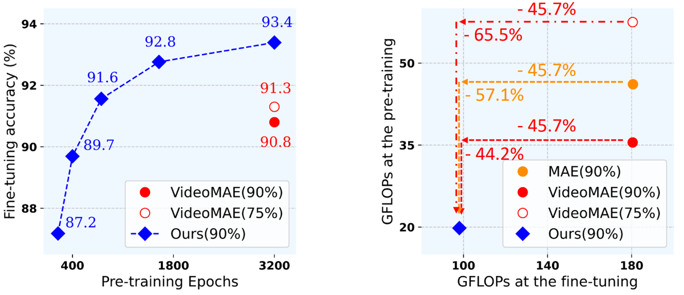

# EVEREST: Efficient Masked Video Autoencoder by Removing Redundant Spatiotemporal Tokens [ICML2024]

This repository is an official Pytorch implementation of [EVEREST: Efficient Masked Video Autoencoder by Removing Redundant Spatiotemporal Tokens](https://arxiv.org/abs/2211.10636).

**The new version of EVEREST will be updated soon!!!** 🚨

<p align="center">
  
</p>

## Abstract

Masked Video Autoencoder (MVA) approaches have demonstrated their potential by significantly outperforming previous video representation learning methods. However, they waste an excessive amount of computations and memory in predicting uninformative tokens/frames due to random masking strategies. (e.g., over 16 nodes with 128 NVIDIA A100 GPUs). To resolve this issue, we exploit the unequal information density among the patches in videos and propose EVEREST, a surprisingly efficient MVA approach for video representation learning that finds tokens containing rich motion features and discards uninformative ones during both pre-training and fine-tuning. We further present an information-intensive frame selection strategy that allows the model to focus on informative and causal frames with minimal redundancy. Our method significantly reduces the computation and memory requirements of MVA, enabling the pre-training and fine-tuning on a single machine with 8 GPUs while achieving comparable performance to computation- and memory-heavy baselines on multiple benchmarks and the uncurated Ego4D dataset. We hope that our work contributes to reducing the barrier to further research on video understanding.

## Results

<p align="center">
  
</p>

## Prerequisites
EVEREST is built in **Python 3.7.12**, **torch 1.8.0** and **torchvision 0.9.0**. Please use the following command to install the requirements:
```
$ pip install -r requirements.txt
```

## Run
1. __UCF101__ experiment
```
$ bash scripts/ucf101/pretrain.sh
$ bash scripts/ucf101/finetune.sh
```

2. __HMDB51__ experiment

```
$ bash scripts/hmdb51/pretrain.sh
$ bash scripts/hmdb51/finetune.sh
```

3. __K400, SSv2, OSCC__ experiment will be released soon.

## Dataset
1. Download [UCF101](https://www.crcv.ucf.edu/data/UCF101.php) and [HMDB51](https://serre-lab.clps.brown.edu/resource/hmdb-a-large-human-motion-database/) datasets from the official websites.
2. Make annotation files in `*.csv` format like this:
```
path_to_video/video_0.avi 0
path_to_video/video_1.avi 0
...
path_to_video/video_N.avi 101
```

## Training Logs and Checkpoints
### UCF101

| Backbone | \#Frame |                          Pre-train (3,200 epochs)                           |                          Fine-tune (100 epochs)                           | Top-1 | Top-5 |
| :------: | :-----: | :----------------------------------------------------------: | :----------------------------------------------------------: | :---: | :---: |
|  ViT-B   |  16x5x3  | [log](https://drive.google.com/file/d/1dupg3ultdh1qsijUAYSZm8-hW2SAspLT/view?usp=share_link) / [checkpoint](https://drive.google.com/file/d/1liGNGprKdfiOCArK-WMqIcfeOJ-AZKzr/view?usp=share_link) | [log](https://drive.google.com/file/d/1EMlHBPqTC1_QURiCiaOdwPeoXdL67Gql/view?usp=share_link) / [checkpoint](https://drive.google.com/file/d/1iGFUxYpzjb7zaajB0O0j1MzS6PzyzrQF/view?usp=share_link) | 93.7  | 98.9  |

## Contact
Sunil Hwang: sunilhoho@kaist.ac.kr   
Jaehong Yoon: jaehong.yoon@kaist.ac.kr

## Acknowledgment
The code is built upon [VidoeMAE](https://github.com/MCG-NJU/VideoMAE).

## Citations
```
@inproceedings{hwang2024everest,
    title={EVEREST: Efficient Masked Video Autoencoder by Removing Redundant Spatiotemporal Tokens},
    author={Hwang, Sunil and Yoon, Jaehong and Lee, Youngwan and Hwang, Sung Ju},
    booktitle={International Conference on Machine Learning},
    year={2024},
}
```